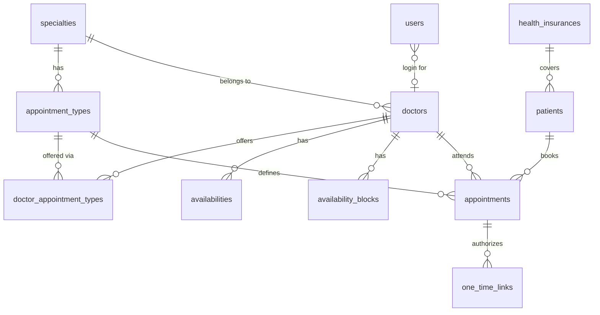

# Data Model — Next Visit

## Overview

The database is the single source of truth for all domain data (Neon Postgres, raw SQL — see ADR-0002/0003). It models a single clinic where patients book, cancel, and reschedule appointments with a specific doctor on the web without an account (ADR-0001).

What this schema solves:

- **Catalog**: specialties → appointment types (with fixed durations) → doctors, plus the offering join (`doctor_appointment_types`) of which types each doctor actually offers.
- **Slot generation**: doctor availability is stored as recurring weekly hours (`availabilities`) with exceptions (`availability_blocks`); bookable slots are *computed* on demand, never stored as rows.
- **Booking integrity**: appointments are a concrete (patient, doctor, type, start time) booking; a partial unique index on `(doctor_id, starts_at)` (excluding cancelled) makes double-booking impossible even under concurrency.
- **Identity without accounts**: patients are identified by their DNI; each appointment has a single-use, expiring one-time link that authorizes cancel/reschedule.
- **Anti-spam**: `booking_attempts` rate-limits attempts by DNI; the 3-active-appointments cap is enforced in the booking service (ticket 04/14).
- **Staff**: `users` holds admin/secretary/doctor credentials; doctors link to a `doctors` row.

## Main Entities (12 tables)

| Table | Purpose |
| --- | --- |
| `specialties` | Area of medical care the patient picks first (e.g. cardiology). |
| `appointment_types` | Kind of care within a specialty, with a fixed duration in minutes. |
| `doctors` | A healthcare professional who attends appointments, in one specialty. |
| `doctor_appointment_types` | Join: which appointment types each doctor offers. |
| `availabilities` | A doctor's recurring weekly working hours (weekday + start/end time). |
| `availability_blocks` | Holiday/absence exceptions that suppress slots on a specific date. |
| `health_insurances` | Obra social/insurance and the copay amount it determines. |
| `patients` | A person who books, identified by DNI. |
| `appointments` | A confirmed booking: patient, doctor, type, start time, duration, channel, status, copay. |
| `one_time_links` | Single-use, expiring token authorizing cancel/reschedule of an appointment. |
| `users` | Staff accounts (admin/secretary/doctor) with hashed passwords. |
| `booking_attempts` | Anti-spam rate-limiting log keyed by DNI. |

## Entity Relationships



## Critical Constraints

- **No double-booking**: a partial unique index on `(doctor_id, starts_at)` where `status <> 'cancelled'` — two active appointments for the same doctor can never start at the same instant, enforced at the DB level under any concurrency. A cancelled appointment releases its slot so the same start time can be re-booked (needed for rescheduling).
- **Positive durations**: `CHECK (duration_minutes > 0)` on `appointment_types` and `appointments`.
- **Well-formed availability windows**: `CHECK (end_time > start_time)` on `availabilities` and `availability_blocks`.
- **Valid weekday**: `CHECK (weekday BETWEEN 1 AND 7)` on `availabilities` (ISO, 1 = Monday).
- **Non-negative copays**: `CHECK (copay_amount >= 0)` on `health_insurances` and `appointments`.
- **Identity anchors**: `specialties.name`, `health_insurances.name`, `patients.dni`, `one_time_links.token`, `users.email` are unique.

## Appointment Lifecycle

An appointment moves through **three lifecycle states** (see `CONTEXT.md`):

- `scheduled` → booked, not yet started.
- `cancelled` → the appointment was cancelled (online via one-time link within the cancellation window, or by the secretary).
- `ended` → the appointment time has passed.

No-show is a **flag on ended**, not a separate lifecycle state: an `attendance` column on `appointments` takes `pending` / `attended` / `no_show`. When an appointment's time passes, a scheduled job marks it `ended` + `no_show` automatically (ADR-0004); the secretary flips `no_show` → `attended` when the patient arrives and pays (ticket 10).

```
scheduled ──cancelled──► cancelled
   │
   └──time passes──► ended (attendance: pending → no_show, auto)
                        └──secretary──► attendance: attended
```

## Access Policies (Application RBAC)

Enforced in the API/service layer (tickets 07–13), not at the DB:

- **Admin**: creates staff credentials (users), manages the health-insurance → copay table.
- **Secretary**: maintains doctor availability + blocks, books on behalf of patients (front desk / phone), cancels/reschedules any appointment, records attendance and copay.
- **Doctor**: read-only access to their own upcoming appointments.
- **Patient (no account)**: books; cancels/reschedules only via the single-use one-time link for their own appointment (ADR-0001).

## Migrations

| Date | File | Description |
| --- | --- | --- |
| 2026-08-14 | `server/src/db/migrations/0001_initial_schema.sql` | All 12 tables, enums, indexes, constraints. |

Migrations are applied in filename order by `server/src/db/migrate.ts`, which records applied files in a `schema_migrations` table. `server/src/db/schema.sql` mirrors the current schema and is the canonical DDL reference (it also documents the `schema_migrations` bookkeeping table).

## Seed Data

`server/src/db/seed.ts` (idempotent — safe to re-run) populates:

- **4 specialties**: Cardiología (2 doctors), Dermatología (1), Traumatología (2), Pediatría (1).
- **Appointment types** per specialty with fixed durations (e.g. consulta 30′, electrocardiograma 20′, ecocardiograma 45′).
- **doctor_appointment_types**: every doctor offers every type of their specialty.
- **4 health insurances** with distinct copay amounts: IOMA ($5000), PAMI ($3000), OSDE ($12000), Swiss Medical ($15000).
- **Users** (all with dev password `nextvisit123`): `admin@nextvisit.ar` (admin), `secretary@nextvisit.ar` (secretary), and one doctor user per specialty (the first doctor of each).

Seed credentials are development-only; production credentials come from the admin (ticket 12).